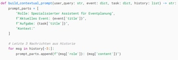

# 📅 EventManager WebApp

Ein intelligentes, KI-gestütztes Event- und Aufgabenmanagement-Tool mit Quizfunktion, Dark Mode und Export-Features – optimiert für Teams, Studierende und Projektmanager.

---

## 🔎 Inhaltsverzeichnis

1. [Projektüberblick](#projektüberblick)
2. [Zielgruppe](#zielgruppe)
3. [Angebot & Vertragsmodell](#angebot-- &--vertragsmodell)
4. [Screenshots & UI-Erläuterung](#screenshots--ui-erklärung)
5. [Lean Analytics Ansatz](#lean-analytics-ansatz)
6. [Funktionen](#funktionen)
7. [Technologien](#technologien)
8. [Installation](#installation)
9. [Starten der App](#starten-der-app)
10. [Navigationsseiten](#navigationsseiten)
11. [API-Endpunkte](#api-endpunkte)
12. [Datenbankstruktur](#datenbankstruktur)
13. [Import & Export](#import--export)
14. [KI-Integration](#ki-integration)
15. [MVP: Umsetzung & Screenshots](#mvp-umsetzung--screenshots)
16. [Zukünftige Erweiterungen](#zukünftige-erweiterungen)
17. [Deployment](#deployment)
18. [Unit Testing](#-unit-testing--testabdeckung)
19. [FAQ & Troubleshooting](#faq--troubleshooting) 

---

## 💡 Projektüberblick

Die EventManager-App bietet:

- 📅 Verwaltung von Events & Aufgaben
- 🧠 KI-gestützte Quizfragen
- 📈 Fortschrittsanalyse
- 💬 Aufgabenbezogener Chat
- 🌙 Dunkelmodus für ermüdungsfreies Arbeiten
- 📤 CSV-/Excel-Import & -Export

Zielgruppen:
- Projektmanager  
- Studierende  
- Lehrer*innen  
- Teams, die Wissensarbeit strukturieren möchten  

---

## 🧑‍🎓 Zielgruppe

Der **EventManager** richtet sich an eine breite Zielgruppe, die organisiert lernen, planen oder Wissen strukturieren möchte.

### Typische Nutzergruppen:

- **Studierende**  
  Zur strukturierten Vorbereitung auf Prüfungen und zum Selbstmanagement

- **Projektteams**  
  Für die Organisation gemeinsamer Aufgaben, Meetings und Statusverfolgung

- **Vereine & Organisationen**  
  Planung von Veranstaltungen, Aufgabenverteilung und Fortschrittskontrolle

- **Bildungseinrichtungen**  
  Für Lehrpersonal und Verwaltung zur Aufgabenkoordination und Erfolgsmessung

- **Selbstorganisierte Personen**  
  Für persönliche Weiterbildung, Habit-Tracking und Wissensaufbau

- **Trainer:innen & Coaches**  
  Begleitung von Lernprozessen, Aufgabensteuerung für Klient:innen

- **Veranstaltungsplaner:innen**  
  Organisation von Events, Programmpunkten und Logistik

- **Freelancer**  
  Projekt- und Aufgabenverwaltung für Kund:innen

- **Privatpersonen mit hohem Organisationsbedarf**  
  Strukturierung von Alltag, Projekten und Routinen

- **Nutzer:innen mit Faible für Analysen**  
  Fortschritts- und Wissensauswertung anhand von Statistiken und Diagrammen

---

## 📦 Angebot & Vertragsmodell

Die Monetarisierung der **EventManager WebApp** erfolgt über ein **Freemium-Modell**, 
ergänzt durch klare Lizenzregelungen und eine professionelle Angebotsstruktur. 
Das folgende Kapitel erklärt, wie wir Angebot, Vergütung, Rechtevergabe und 
Vertragsrahmen gestalten – sowohl aus technischer, betrieblicher als auch rechtlicher
Sicht.

### 🧾 Angebotsübersicht

Das Angebot ist Grundlage für den Vertrag mit potenziellen Kunden 
(Einzelpersonen, Organisationen, Unternehmen). Es enthält:

- Beschreibung der Webanwendung
- Features der kostenlosen und kostenpflichtigen Nutzung
- Technische und organisatorische Leistungen
- Nutzungsrechte & Lizenzmodell
- Vertragsmodell: Freemium mit optionalem Premium-Upgrade

### 🧩 Geschäftsmodell: Freemium

**Kostenlose Nutzung** beinhaltet:

- Bis zu **3 aktive Events**
- Max. **10 Aufgaben pro Event**
- **Begrenzter Zugriff auf KI-Funktionen** (z. B. 5 Quiz-Anfragen/Monat)
- CSV-Import möglich, **kein Excel-Import**
- **Kein Team-Sharing** oder API-Zugriff

**Premium-Funktionen** bieten:

- Unbegrenzte Events & Aufgaben
- Excel- & CSV-Import/Export
- Voller Zugriff auf DeepSeek-API
- **Erweiterte Statistiken & Fortschrittsmetriken**
- Teamfunktionen: Aufgaben & Events gemeinsam bearbeiten
- Priorisierter Support & Feature-Wünsche

(siehe Visualisierung unten)

### 📊 Angebotsgrafik

```mermaid
graph TD
    A[EventManager Freemium-Modell]
    A --> B(Kostenlos)
    A --> C(Premium)

    B --> B1[Max. 3 Events]
    B --> B2[10 Tasks pro Event]
    B --> B3[CSV-Import]
    B --> B4[Quiz: 5/Monat]
    B --> B5[Kein Team-Sharing]

    C --> C1[Unbegrenzte Events & Tasks]
    C --> C2[CSV & Excel]
    C --> C3[Unlimitierter Quiz-Zugang]
    C --> C4[Team-Sharing]
    C --> C5[Erweiterte Statistik & Export]
    C --> C6[API-Zugriff für Entwickler]
```

---

### ⚖️ Lizenz & Urheberrecht

Die Webanwendung ist geistiges Eigentum des Entwicklungsteams. 
Der Code, alle UI/UX-Elemente und Funktionen stehen unter der MIT-Lizenz.

**Premium-Nutzer erwerben ein einfaches, nicht exklusives Nutzungsrecht.** Dieses erlaubt:

- Hosting & Betrieb auf eigenen Geräten oder via Webzugang
- Export & Analyse der eigenen Daten
- Nutzung der Software zu privaten oder beruflichen Zwecken

Nicht erlaubt:

- Weiterverkauf oder Unterlizenzierung
- Reverse Engineering
- Nutzung ohne Lizenz bei Premium-Funktionen

---

### 🤝 Vertragstyp: Kombination aus SaaS-Mietvertrag & Werkvertrag

Basierend auf den Empfehlungen aus dem SE-Anhang gelten folgende Rahmenbedingungen:

- **Werkvertrag** für initiale Bereitstellung (Bereitstellung lauffähiger Software)
- **Mietvertrag** für kontinuierliche Nutzung über Freemium-/Premiummodell
- **Dienstvertragselemente** im Support- und Weiterentwicklungsbereich

**Vertragsinhalte:**

- Leistungsbeschreibung: Features laut Freemium-Modell
- Abnahmeprozess: automatische Freischaltung bei Registrierung / Upgrade
- Rechtevergabe: Nutzungsrecht, kein Eigentumsrecht an Software
- Geheimhaltung: E-Mail-Adressen & Daten nur lokal / DSGVO-konform
- Datenschutz: keine Weitergabe an Dritte; OpenRouter API mit eigener DSGVO-Verantwortung
- Haftung: begrenzt auf vorsätzliche und grob fahrlässige Schäden

---

### 📩 Angebot als Auslöser für Vertrag

Ein unterzeichneter Funktionsumfang mit gewähltem Lizenztyp (kostenfrei vs. Premium) 
stellt ein bindendes Angebot dar. Nach Registrierung oder Premiumanfrage gilt der Vertrag 
als angenommen. Premium-Upgrade erfolgt via E-Mail-basierter Workflow (siehe Kapitel E-Mail API).

> Für Organisationen bieten wir erweiterte Angebotsmodelle mit individuellem Supportvertrag, 
SLA und Abrechnung auf Anfrage.

---

**Screenshots (Optional):**

- Pricing-Tabelle aus UI
- Freischalt-Bestätigung
- Angebots-Vorlage als PDF (bereitstellbar für externe Kunden)

---

## 📸 Navigationsseiten

Die App ist in verschiedene, übersichtlich gestaltete Seiten gegliedert. Hier ein Überblick:

### Login & Registrierung

- **Login:** Schneller Zugang zur Plattform
- **Registrierung:** Neues Konto mit Basiszugang erstellen

---

### Dashboard (Übersicht)

Hier sehen Nutzer*innen ihren Premiumstatus, Quiz-Limit und eine Statistik über Events, Quizze und Leistungen.

---

### Events & Aufgaben

Events sind Oberkategorien, denen Aufgaben zugeordnet werden. Diese Aufgaben können geteilt und bewertet werden.

---

### Rätsel / Quiz

Automatisch generierte KI-Quizfragen pro Aufgabe helfen beim Wissensaufbau.

---

### Statistiken

Hier wird der Fortschritt in Prozenten je Event oder Aufgabe visualisiert. Farben und Labels geben schnellen Überblick.

---

### Export / Import

Daten können als CSV oder Excel exportiert und ebenso importiert werden.

---

### Chat

Für jede Aufgabe steht ein KI-Chat zur Verfügung. Fragen können kontextbasiert gestellt werden.

---

### 🌙 Dark Mode

Alle Seiten sind auch im augenschonenden Dark Mode verfügbar:

---

## 📸 Navigationsseiten Dunkelmodus

### 📊 Dashboard:

### 📊 Events:

### 📊 Tasks:

### 📊 Raetsel:

### 📊 Statistik:

### 📊 Export:

### 📊 Chat:

---

## 📘 Lean Analytics Ansatz

Wir analysieren Nutzerverhalten entlang folgender Pfade:

- Einstieg durch 📢 Empfehlungen (Social Media, Gruppen)
- Nutzung der kostenlosen Basisfunktionen
- Identifikation von *Aktivitätsgrenzen*
- Erhöhung der Motivation zum Upgrade (Quizlimit, UI-Hinweise)
- Vermeidung von *Disengagement* durch visuelles Feedback, Statistiken & Reminder
- Ziel: Höheres Engagement → Conversion zu Premium

---

## ⚙ Funktionen

| Funktion          | Beschreibung                                     |
|------------------|--------------------------------------------------|
| 📅 Event-Management  | Events erstellen, bearbeiten, teilen           |
| ✅ Aufgabenverwaltung | Aufgaben zu Events hinzufügen                 |
| 🧩 Quiz-Modus         | KI-generierte Fragen zu Aufgaben              |
| 💬 Aufgaben-Chat      | Kontextbezogene KI-Hilfe                      |
| 📈 Statistik         | Fortschrittsvisualisierung je Event/Aufgabe   |
| 🌙 Dark Mode         | UI-Umschaltung für Augenfreundlichkeit        |
| 📤 Import/Export     | CSV/Excel Unterstützung für Events & Tasks    |

---

## 🧰 Technologien

| Bereich     | Tools                      |
|-------------|----------------------------|
| Frontend    | Streamlit (Python)         |
| Backend     | FastAPI (Python)           |
| Datenbank   | SQLite                     |
| KI          | DeepSeek (via OpenRouter)  |
| Styling     | Plotly, CSS, Icons8        |

---

## 🚀 Installation

### Voraussetzungen

- Python 3.9+  
- pip  
- .env Datei mit API-Key von [OpenRouter](https://openrouter.ai)

### Schritte

bash
git clone https://github.com/dein-repo/eventmanager.git
cd eventmanager
python -m venv venv
source venv/bin/activate  # oder venv\Scripts\activate auf Windows
pip install -r requirements.txt

### Umgebungsvariablen setzen

.env Datei:

env
DEEPSEEK_API_KEY=dein_api_key

Datenbank initialisieren:

bash
python database.py

---

## 🏁 Starten der App

Backend starten:

bash
uvicorn chat_api:app --reload

Frontend starten:

bash
streamlit run app.py

Standard-Login:

- *Benutzername:* admin  
- *Passwort:* Wird bei Registrierung gesetzt

---

## 🧭 Navigationsseiten

- *Dashboard*: Übersicht zu Quiz-Limits, Premiumstatus, Aktivitäten  
- *Events*: Erstellen, Bearbeiten, Teilen  
- *Tasks*: Aufgaben hinzufügen, bearbeiten  
- *Rätsel*: KI-generierte Quizze  
- *Statistiken*: Fortschritt pro Event/Aufgabe  
- *Export*: CSV/Excel Export + Import  
- *Chat*: Kontextuelle KI-Fragen zu Aufgaben  
- *Profil / Einstellungen*: Dark Mode, API-Key  

---

## 📡 API-Endpunkte

| Methode | Pfad | Beschreibung |
|--------|------|--------------|
| GET  | /api/events | Alle Events abrufen |
| POST | /api/events | Neues Event erstellen |
| POST | /api/chat   | Neue Chatnachricht senden |
| GET  | /chat/history | Lade Chatverlauf |
| DELETE | /chat/history | Lösche Chatverlauf |
| POST | /import/events | Events & Aufgaben importieren |

---

## 🗃 Datenbankstruktur

Die Architektur folgt einem relationalen Modell, in dem Nutzer eigene Events verwalten, Aufgaben erstellen und Fortschritte speichern können.

### Tabellenübersicht

- **`users`**  
  Speichert alle Nutzer:innen inkl. Premiumstatus

- **`events`**  
  Alle erstellten Events (z. B. Vorlesungen, Workshops)

- **`tasks`**  
  Aufgaben zu Events, mit Titel und Inhalt

- **`quiz_stats`**  
  Bewertungsdaten und Fortschritt nach Quizteilnahmen

- **`chat_messages`**  
  KI-gestützte Dialoge, die sich auf konkrete Aufgaben beziehen

- **`shared_events`**  
  Von Nutzer:innen öffentlich oder gezielt geteilte Events

- **`shared_tasks`**  
  Von Nutzer:innen geteilte Aufgaben zur Zusammenarbeit oder Inspiration

Tabellen:

- *users*: Nutzer, Premiumstatus  
- *events*: Titel, Beschreibung, Zugehörigkeit  
- *tasks*: Aufgaben zu Events  
- *quiz_stats*: Bewertungen je Aufgabe  
- *chat_messages*: KI-Konversationen pro Task  
- *shared_events*: geteilte Events  

---

## 🔁 Import / Export

### Export
- Auswahl einzelner Events
- Format: CSV oder Excel
- Optional: Aufgaben und Statistiken

### Import
- CSV / Excel Datei mit Spalten:
  - Event ID, Titel, Typ, Beschreibung
  - Aufgabe ID, Aufgabe Titel, Aufgabe Inhalt

---

## 📘 E-MAIL API

Für die Anwendung wurde das Freemium-Geschäftsmodell gewählt,
bei dem Nutzer im kostenlosen Modus eine begrenzte Anzahl von
Events und Aktivitäten verwalten können. Premium-Nutzer erhalten
dagegen unbegrenzten Zugang zu allen Funktionen und können ohne 
Einschränkungen beliebig viele Events und Tasks erstellen. 
Dieses Modell ermöglicht es, neue Nutzer kostenlos anzulocken
und gleichzeitig Einnahmen durch Premium-Upgrades für erweiterte
Funktionalität zu generieren.

Der Premium Account Workflow ist als einfacher E-Mail-basierter
Prozess umgesetzt: Wenn ein Benutzer ein Upgrade anfordert, wird
über die Funktion send_upgrade_request_email() automatisch eine E-Mail
an den Admin (actilywdh@gmail.com) gesendet. Die E-Mail enthält den
Benutzernamen im Betreff und einen HTML-Body mit der Upgrade-Anfrage.
Der Benutzer erhält sofort eine Bestätigungsmeldung, dass seine Anfrage
versendet wurde, muss aber auf die manuelle Freischaltung durch den Admin warten.
Der eigentliche Freischaltungsprozess (Datenbankaktualisierung des Premium-Status)
ist nicht im Code implementiert und muss vom Admin manuell durchgeführt werden.

Beispiel einer Anfrage:

---

# 🤖 KI-Integration

## 🔧 Architektur

Die KI-Integration basiert auf einem modularen und fehlertoleranten Aufbau:

- **📧 API-Adapter**: Die App verwendet DeepSeek als KI-Modell, angebunden über die Plattform [OpenRouter.ai](https://openrouter.ai). Ein dedizierter Adapter stellt sicher, dass alle API-Anfragen korrekt authentifiziert und verarbeitet werden.
- **🔹 Authentifizierung**: Die Kommunikation erfolgt über API-Keys, die sicher in einer `.env` Datei gespeichert werden (`DEEPSEEK_API_KEY`).
- **⏳ Asynchroner Datenverkehr**: Die KI-Anfragen (z. B. für Quizfragen oder Chatantworten) werden mit `httpx.AsyncClient` gesendet. Ein eingebauter Retry-Mechanismus sorgt für Ausfallsicherheit, falls die KI nicht direkt antwortet.

## 🎓 Prompt Engineering

Die Qualität der KI-Ausgabe hängt stark vom Prompt ab. Daher nutzt das System dynamische Prompt-Erstellung:

- **Rollenbasiert**: Die KI wird durch systematische Rollenbeschreibung dazu gebracht, als "Eventplanungs-Assistent" zu agieren. Dadurch versteht sie, welche Art von Wissen gefragt ist.
- **Kontextuelle Datenintegration**: Zu jeder Aufgaben- oder Eventinteraktion werden automatisch Metadaten eingebunden, darunter:
  - Titel und Beschreibung des Events
  - Aufgabentext
  - Relevanter Verlauf vorheriger Chatnachrichten
- **Ausgabeformat**: Die Antwort der KI ist strukturiert als JSON-Objekt, das direkt in der App verarbeitet wird (z. B. für Quizfragen oder Auswertungen).

## 📈 KI-Fragenlogik (Quiz-Modul)

Wenn ein*e Nutzer*in den Quiz-Modus aktiviert, wird folgende Logik ausgelöst:

1. Die aktuelle Aufgabe (inkl. Titel und Beschreibung) wird per Prompt an die KI gesendet.
2. Die KI antwortet mit:
   - Einer gut formulierten Frage
   - Drei Antwortoptionen
   - Angabe der korrekten Antwort
   - Einer erklärenden Begründung zur Lösung
3. Diese Daten werden in der `quiz_stats`-Tabelle gespeichert.
4. Die Fortschrittsstatistik (bestehen/nicht bestehen) wird automatisch aktualisiert.

**Vorteil**: Der Lernprozess wird durch aktive Rückmeldung unterstützt und kann visuell im Statistikmodul verfolgt werden.

## 🔄 Bewertung / Scoring

- Die Ergebnisse der KI-basierten Quizzes fließen direkt in die persistente Datenbankstruktur ein (`quiz_stats`).
- Jede Aufgabe hat eine eigene Bewertungshistorie.
- Fortschrittsdiagramme zeigen:
  - Anzahl der korrekt beantworteten Fragen
  - Lernkurve pro Event
  - Durchsatz (z. B. wie viele Aufgaben durchlaufen wurden)

**Visualisierung** erfolgt im Statistikmodul über farbkodierte Balken und Prozentskalen.

---

# 📚 MVP: Umsetzung & Screenshots

## 🔢 Realisierte User Stories (aus Kapitel 3 der MAF-Präsentation)

| **Bereich**   | **Funktion**                              | **Status**       |
|---------------|-------------------------------------------|------------------|
| Events        | Erstellen, Bearbeiten, Teilen             | ✅ Implementiert |
| Aufgaben      | Hinzufügen, Zuweisung zu Events           | ✅ Implementiert |
| Quiz          | Fragegenerierung via KI, Scoring          | ✅ Implementiert |
| Statistik     | Fortschrittsauswertung, visuelle Anzeige  | ✅ Implementiert |
| Export/Import | Daten im CSV/Excel-Format verarbeiten     | ✅ Implementiert |
| Chat          | Kontextualisierte KI-Hilfe pro Aufgabe    | ✅ Implementiert |
| UI/UX         | Dark Mode, Navigation, mobile-optimiert   | ✅ Implementiert |

## 🖼️ Screenshots (Auswahl)

- **MVP-Demo**: Umsetzung der Basisfunktionen mit Navigationsstruktur und Event-Erstellung
- **Quiz-Modus**: Fragenansicht mit Feedback und Auswertung (siehe Screenshot:)

- **Chatmodul**: Kontextuelles Eingabefeld mit Verlauf (siehe Screenshot:)

- **Statistikansicht**: Fortschrittsvisualisierung je Event (siehe Screenshot:)

---

# 🧪 Grafische Übersicht des Deployments

Hier ist ein schematisches Diagramm, wie dein Deployment mit GitHub Actions und Docker abläuft:

## 🚀 Deployment der Anwendung

Unsere Anwendung besteht aus einer Streamlit-Weboberfläche sowie zwei FastAPI-Services,
die zusammen in einem Docker-Container bereitgestellt werden. Das Deployment erfolgt automatisiert über GitHub Actions.

### 1. Architektur der Anwendung

- **Streamlit** (Frontend) läuft auf Port 8501

- **FastAPI-Service** 1 (Chat API) läuft auf Port 8000

- **FastAPI-Service** 2 (Import API) läuft auf Port 8001

Die Services werden in einem einzigen Container ausgeführt, der über folgendes CMD im Dockerfile gestartet wird:

CMD ["sh", "-c", "streamlit run app.py & uvicorn utils.chat_api:app --host 0.0.0.0 --port 8000 & uvicorn utils.import_d

### 2. Automatisiertes Deployment mit GitHub Actions
Sobald ein Commit auf den main-Branch gepusht wird, startet GitHub Actions unseren CI/CD Workflow
(.github/workflows/docker-image.yml):

Checkout des Codes
- **Holt das Repository in die Pipeline.**

Docker Buildx Setup
- **Ermöglicht plattformunabhängiges Docker-Building.**

Login bei Docker Hub
- **Nutzt DOCKER_HUB_USERNAME und DOCKER_HUB_TOKEN aus den Repository Secrets.**

Docker Image Build & Push
- **Baut das Image und pusht es zu Docker Hub**
    - **username/eventmanager:latest**
    - **username/eventmanager:<commit-sha>**

### 3. Start der Anwendung auf dem Server
Auf einem beliebigen Server (z. B. AWS, Azure, Hetzner) kann die Anwendung dann einfach durch Docker Pull & Run gestartet werden:

# Neueste Version vom Docker Hub laden
docker pull <dockerhub-username>/eventmanager:latest

# Container starten
docker run -d -p 8501:8501 -p 8000:8000 -p 8001:8001 <dockerhub-username>/eventmanager:latest
Danach sind die Services erreichbar unter:

Streamlit: http://<server-ip>:8501

Chat API: http://<server-ip>:8000

Import API: http://<server-ip>:8001

4. Vorteile dieses Deployments
✅ Vollständig automatisiertes Bauen und Pushen des Docker-Images
✅ Einheitlicher Container für Frontend (Streamlit) und Backend (FastAPI)
✅ Schnelle Bereitstellung auf jedem Server mit Docker-Unterstützung

## 🧪 Live-Test-Demo

Für Entwickler:innen steht ein interaktiver Testmodus zur Verfügung:

bash
python -m pytest tests/ -v --pdb

Features:

-**🔍 Debugging bei Fehlschlägen (--pdb)**

-**⏱️ Performance-Messung (--durations=10)**

-**🧩 Markierte Tests (@pytest.mark.integration)**

---

# 🧪 Unit Testing & Testabdeckung

## 📊 Testabdeckung

Unser Testkonzept sichert die Qualität der EventManager-WebApp durch systematische Unit-Tests,
die alle kritischen Funktionen abdecken.Die Tests folgen den Best Practices des Test-Driven 
Development (TDD) und nutzen Pytest als Framework.

pie
    title Testabdeckung nach Modulen
    "Datenbank" : 35
    "Authentifizierung" : 20
    "Event-Management" : 25
    "Task-Management" : 15
    "Statistiken" : 5

## 🔧 Technischer Aufbau

-**Framework: Pytest mit Coverage (85%+)**
-**Mocking: unittest.mock**

## 🧪 Live-Test-Demo

Für Entwickler:innen steht ein interaktiver Testmodus zur Verfügung:

bash
python -m pytest tests/ -v --pdb

Features:

-**🔍 Debugging bei Fehlschlägen (--pdb)**

-**⏱️ Performance-Messung (--durations=10)**

-**🧩 Markierte Tests (@pytest.mark.integration)**

---

## ❓ FAQ & Troubleshooting

- **Fehler bei st.cache:**  
  → Ersetze durch st.cache_data oder st.cache_resource.

- *Quiz-Limit erreicht?*  
  → Upgrade auf Premium, um unbegrenzt zu quizzen.

- *Chat funktioniert nicht?*  
  → Stelle sicher, dass dein API-Key korrekt in .env gespeichert ist.

---

## 👨‍💻 Entwickler:innen

Pull Requests, Feature-Ideen und Feedback willkommen!  
MIT Lizenz – Frei für eigene Anpassungen und Weiterverwendung.

---
